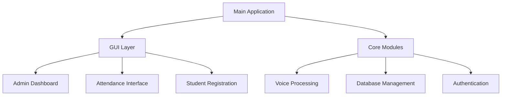
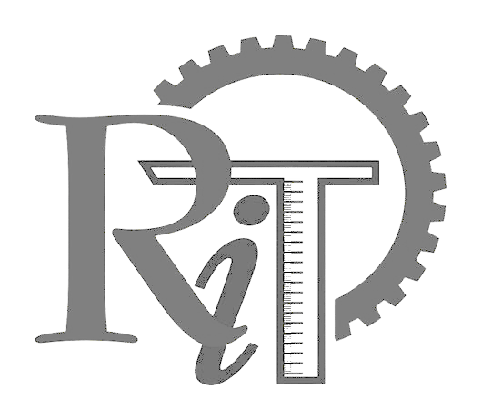

# Voice Based Attendance Management System (VBAMS) 🎓

<div align="center">


[](https://www.python.org/)
[](https://www.riverbankcomputing.com/software/pyqt/)
[](LICENSE)
[](https://github.com/yourusername/Voice_Based_Attendance_Management_System/graphs/commit-activity)

### A Next-Generation Attendance System with Voice Biometrics 🎤

*Revolutionizing attendance tracking with cutting-edge voice recognition technology*

[Features](#features) • [Installation](#installation) • [Usage](#usage-guide) • [Documentation](#documentation) • [Support](#support)

---

</div>

## ✨ Key Features

<table>
  <tr>
    <td>
      <h3>🔊 Voice Recognition</h3>
      <ul>
        <li>Advanced biometric authentication</li>
        <li>Noise reduction technology</li>
        <li>Multiple voice sample support</li>
      </ul>
    </td>
    <td>
      <h3>🔐 Security</h3>
      <ul>
        <li>Two-factor authentication</li>
        <li>Encrypted data storage</li>
        <li>Comprehensive audit logs</li>
      </ul>
    </td>
  </tr>
  <tr>
    <td>
      <h3>📊 Analytics</h3>
      <ul>
        <li>Detailed attendance reports</li>
        <li>Excel export functionality</li>
        <li>Visual attendance trends</li>
      </ul>
    </td>
    <td>
      <h3>⚙️ Administration</h3>
      <ul>
        <li>Student management</li>
        <li>Manual override options</li>
        <li>Automated data cleanup</li>
      </ul>
    </td>
  </tr>
</table>

## 🚀 Quick Start

### Prerequisites

<table>
  <tr>
    <td>
      
    </td>
    <td>
      Python 3.8+
    </td>
    <td>
      <a href="https://www.python.org/downloads/">Download</a>
    </td>
  </tr>
  <tr>
    <td>
      
    </td>
    <td>
      PyQt5
    </td>
    <td>
      Automatically installed
    </td>
  </tr>
</table>

### One-Click Installation 🔥

**Windows**
```bash
# Just double-click
Run_VBAMS.bat
```

**Linux/macOS**
```bash
# Terminal installation
pip install -r requirements.txt
python main.py
```

## 📚 Documentation

### System Architecture



### Directory Structure 📁

<pre>
Voice_Based_Attendance_Management_System/
├── 📱 gui/                # User Interface Components
├── ⚙️ modules/            # Core System Modules
└── 🎤 voice_samples/      # Voice Profile Storage
</pre>

### First-Time Setup Guide 🔧

1. **Launch Application**
   ```bash
   Run_VBAMS.bat
   ```

2. **Admin Login**
   - Username: `admin`
   - Password: `admin123`

3. **Configure 2FA**
   - Scan QR with Google Authenticator
   - Enter verification code

## 🛠️ Configuration

### config.json
```json
{
    "temp_samples_retention_days": 1,
    "attendance_records_retention_months": 6,
    "min_voice_confidence": 0.60
}
```

## 🎯 Usage Examples

### Student Registration
1. Login as Admin
2. Navigate to Student Management
3. Click "Register New Student"
4. Follow the voice recording prompts

### Taking Attendance
1. Select "Mark Attendance"
2. Click "Start Recording"
3. Speak naturally
4. View confirmation

## 🔍 Troubleshooting

<details>
<summary><b>Voice Recognition Issues</b></summary>

- Ensure quiet environment
- Speak clearly and consistently
- Check microphone settings
- Try re-recording voice samples
</details>

<details>
<summary><b>Installation Problems</b></summary>

- Update pip: `python -m pip install --upgrade pip`
- Install VC++ Build Tools (Windows)
- Check system requirements
</details>

## 🔒 Security Best Practices

- ✅ Change default admin password
- ✅ Enable 2FA immediately
- ✅ Regular database backups
- ✅ Monitor system logs
- ✅ Keep software updated

## 🤝 Contributing

We welcome contributions! Here's how you can help:

1. 🍴 Fork the repository
2. 🌿 Create a feature branch
3. 📝 Make your changes
4. 🔍 Test thoroughly
5. 📤 Submit a pull request

## 📄 License

This project is licensed under the MIT License - see the [LICENSE](LICENSE) file for details.

## 🙏 Acknowledgments

- PyQt5 Team for the amazing GUI framework
- Resemblyzer for voice recognition capabilities
- All our contributors and supporters

## 📞 Support & Contact

<div align="center">

Need help? We're here for you!

[](docs/)
[](issues/new)
[](issues/new)

</div>

---

<div align="center">

Made with ❤️ By Modhak G N



**Empowering Education Through Innovation**

</div>
